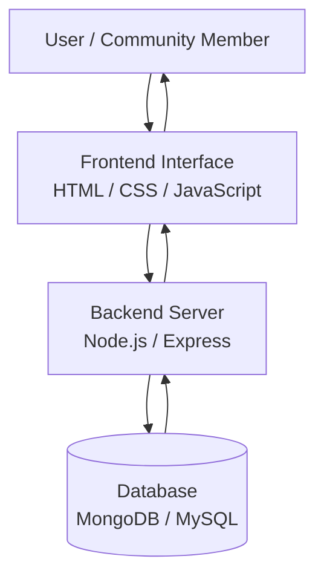

## System Architecture Diagram



---

# What this diagram shows

The system has **three main layers**:

### User Layer
People interact with the platform through a web browser.

### Frontend Layer
The frontend handles:

- displaying items
- showing forms
- user interaction

Built with:

```

HTML
CSS
JavaScript

```

---

### Backend Layer
The backend processes requests such as:

- posting donation items
- retrieving item listings
- handling requests

Built with:

```

Node.js
Express

```

---

### Database Layer
The database stores information such as:

- item listings
- item descriptions
- categories
- contact information

Possible technologies:

```

MongoDB
MySQL
---
helps for database management

